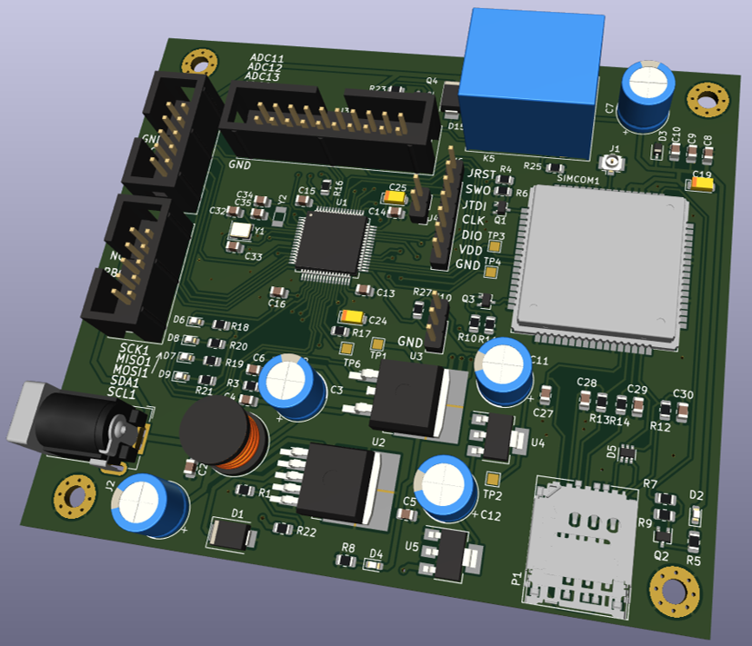

# Система мониторинга серверной комнаты

Проект по разработке модуля для мониторинга серверной комнаты

## Основные характеристики
- Выход в интернет с помощью модуля SIM800
- Передача данных по протоколу MQTT
- Возможность подключения внешней периферии
- Возможность удаленно обновить программу микроконтроллера
- Отправка данных с датчиков и получение управляющих команд
- Главный микроконтроллер - STM32F446RE

## Принципиальная схема устройства

## Программная часть

Проект разработан на языке C с применением библиотеки HAL в среде CubeIDE.

Ветка с основынм кодом - [new_F446](https://github.com/alexmangushev/STM_SIM800_MQTT_remote_control/tree/new_F446)

Ветка с кодом загрузчика - [Пока не добавлена](https://github.com/alexmangushev/STM_SIM800_MQTT_remote_control/tree/new_F446)